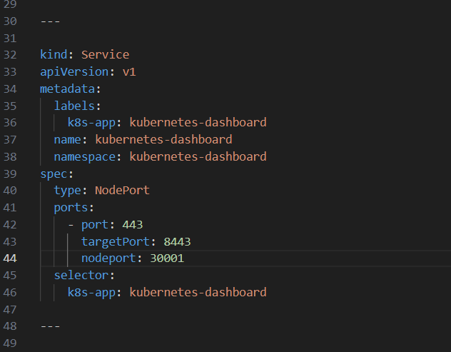
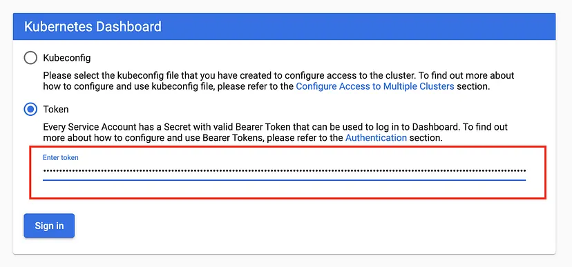
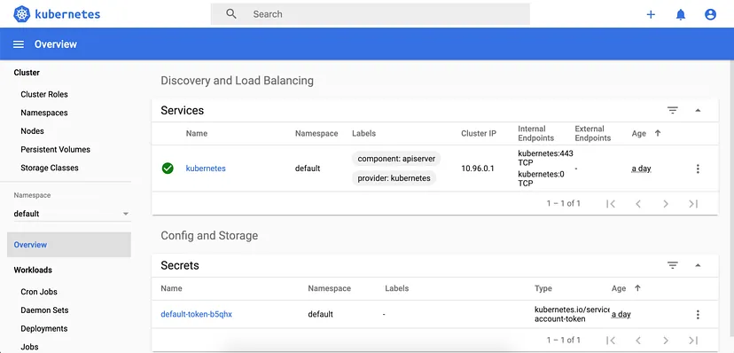

Step 1: 

Save and edit the definition file
Instead of immediately applying the recommended.yaml file as the other instructions. Download it by following the link below and save it :

$ mkdir ~/dashboard
$ cd ~/dashboard
$ curl -O https://raw.githubusercontent.com/kubernetes/dashboard/v2.7.0/aio/deploy/recommended.yaml

Step 2:

I have added for nodeport for service

Step 3: Deploy control panel

$ kubectl create -f  ~/dashboard/recommended.yaml
# As a result, you can check out the pods, the services
$ kubectl get pods -A  -o wide
$ kubectl get service -n kubernetes-dashboard  -o wide

Step 4: Create admin panel

Define ServiceAccount , check the dashboard-admin.yaml

Create service account by below command:

$ kubectl create -f ~/dashboard/dashboard-admin.yaml

Step 5: 
Define ClusterRoleBinding
check dashboard-admin-bind-cluster-role.yaml

Create ClusterRoleBinding by below command:

$ kubectl create -f ~/dashboard/dashboard-admin-bind-cluster-role.yaml

Step 6: 
For Metrics in Kubernetes dashboard:
Download the components.yaml file manually:

wget https://github.com/kubernetes-sigs/metrics-server/releases/latest/download/components.yaml

Then edit the args section under Deployment section

spec:
  containers:
  - args:
    - --cert-dir=/tmp
    - --secure-port=443
    - --kubelet-preferred-address-types=InternalIP,ExternalIP,Hostname
    - --kubelet-use-node-status-port
    - --metric-resolution=15s

add there two more lines:

- --kubelet-insecure-tls=true
- --kubelet-preferred-address-types=InternalIP

kubelet Of 10250 The port uses https agreement , The connection needs to be verified by tls certificate. Adding , — kubelet-insecure-tls tells it does not verify client certificate.

After this modification just apply the manifest:

kubectl apply -f components.yaml

wait a minute and you will see metrics server pod is up

You can now access: https: // NodeIP: 30001

Step 7: 
Getting a Bearer Token

$ kubectl -n kubernetes-dashboard create token admin-user

It should print something like: 

"eyJhbGciOiJSUzI1NiIsImtpZCI6IiJ9.eyJpc3MiOiJrdWJlcm5ldGVzL3NlcnZpY2VhY2NvdW50Iiwia3ViZXJuZXRlcy5pby9zZXJ2aWNlYWNjb3VudC9uYW1lc3BhY2UiOiJrdWJlcm5ldGVzLWRhc2hib2FyZCIsImt1YmVybmV0ZXMuaW8vc2VydmljZWFjY291bnQvc2VjcmV0Lm5hbWUiOiJhZG1pbi11c2VyLXRva2VuLXY1N253Iiwia3ViZXJuZXRlcy5pby9zZXJ2aWNlYWNjb3VudC9zZXJ2aWNlLWFjY291bnQubmFtZSI6ImFkbWluLXVzZXIiLCJrdWJlcm5ldGVzLmlvL3NlcnZpY2VhY2NvdW50L3NlcnZpY2UtYWNjb3VudC51aWQiOiIwMzAzMjQzYy00MDQwLTRhNTgtOGE0Ny04NDllZTliYTc5YzEiLCJzdWIiOiJzeXN0ZW06c2VydmljZWFjY291bnQ6a3ViZXJuZXRlcy1kYXNoYm9hcmQ6YWRtaW4tdXNlciJ9.Z2JrQlitASVwWbc-s6deLRFVk5DWD3P_vjUFXsqVSY10pbjFLG4njoZwh8p3tLxnX_VBsr7_6bwxhWSYChp9hwxznemD5x5HLtjb16kI9Z7yFWLtohzkTwuFbqmQaMoget_nYcQBUC5fDmBHRfFvNKePh_vSSb2h_aYXa8GV5AcfPQpY7r461itme1EXHQJqv-SN-zUnguDguCTjD80pFZ_CmnSE1z9QdMHPB8hoB4V68gtswR1VLa6mSYdgPwCHauuOobojALSaMc3RH7MmFUumAgguhqAkX3Omqd3rJbYOMRuMjhANqd08piDC3aIabINX6gP5-Tuuw2svnV6NYQ"

Now copy the token and paste it into the Enter token field on the login screen.

Log in to the Control Panel with the newly obtained token.

